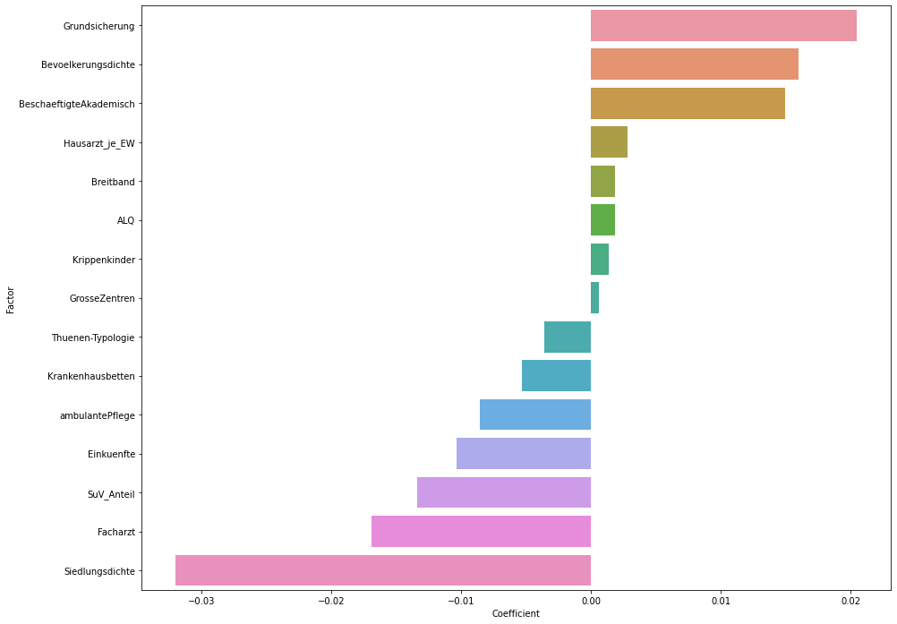

{:class="img-responsive"} 

# Corona is affecting everyone - from a global to a local level!
The corona crisis is unfolding worldwide: States, municipalities, villages, and citizens are facing unprecedented, existential challenges. Corona is a global crisis, that does not stop at border checkpoints and has been deeply affecting our everyday live. No global crisis in modern history has been so closely monitored with data. The access to dashboards and other data visualizations show us almost in real time the cruel reality of a quickly spreading pandemic within a globalized world. 

At the same time, the huge quantity of data on this outbreak allows us to gain valuable insights on how to best tackle the negative consequences COVID-19 has on our lives. Scientists, politicians and civil society are coming closer to develop data-driven solutions. We want to contribute to this effort and have come together as individuals from diverse backgrounds and professions to join forces in analyzing the data available and identifying what we call the “positive deviants”. 

# Identifying Positive Deviance: Local Solutions for Global Challenges
Positive Deviants are individuals, groups, cities, regions etc. who outperform their peers in a comparable context thanks to creative and highly adaptive solutions they have come up with. These solutions have proven to work in a specific context and offer as such a high potential to support their peers facing the same challenges. The Positive Deviance approach was first developed in the 1990s by Sternin and Sternin on child nutrition in Vietnam [Pascale, Sternin and Sternin (2010)](https://books.google.de/books/about/The_Power_Of_Positive_Deviance.html?id=nBgDmcy9SnkC&redir_esc=y "Pascale, Sternin and Sternin (2010)"). [Albanna and Heeks (2018)](https://onlinelibrary.wiley.com/doi/full/10.1002/isd2.12063 "Albanna and Heeks (2018)") have looked into the possibility of identifying positive deviants through the analysis of big data, e.g. identifying rice farmers through satellite imagery who manage to produce significantly higher yields than their peers. Solutions developed by Positive Deviants are so effective as they are locally developed, highly context-sensitive, and usually involve a great level of ownership by their communities. Regarding the huge challenges we are facing as local communities, we believe that the positive deviance approach has a great potential to help counties and municipalities in tackling the devastating consequences of the corona outbreak.  

# Applying the Positive Deviance approach to tackle the Corona crisis
While most communities are experiencing existential challenges through the corona outbreak, some communities are more successful in facing them than others, despite facing similar circumstances. **The objective of this challenge is to find and learn from them!**

We believe that understanding how communities deal with the outbreak and find solutions they have come up with, can effectively support existing efforts to deal with the Corona outbreak. 
Therefore our objective is to identify those communities who have managed to deal better with COVID-19 than others - our “Positive Deviants”.

On our endeavour to identify those communities, we a.) need to make communities comparable. Therefore, we statistically control for a wide range of structural variables - such as population density, hospital beds or age distribution. This allows us to cluster those counties and municipalities with similar resources and structural conditions. Based on an analysis of this cluster, we b.) might be able to identify structural conditions who could have a correlation with the spread of the virus. However more than anything we are c.) striving to identify communities that outperform others in dealing with Covid-19 - **independently** from accessible resources or other structural conditions, but thanks to their behaviour and specific solutions. 

# Analysis
{:class="img-responsive"}

## Our Methodology
As the Coronavirus spreads, the number of infected people grows exponentially. In all countries, infected people infect others, who themselves can infect more people. This pattern can also be observed within the individual districts (Landkreise/Kreisfreie Städte) within Germany. **We try to identify those districts, where the virus spreads relatively slowly compared to other districts. We first statistically control for any structural influence on this performance and then identify the districts that are outperforming other districts based on unusual behaviors:  Positive Deviants.** Using open source data, we aim to find connections between district characteristics on the one hand, and infection speed on the other hand. 

## 1. Gathering the data
In a first step, **we use data on structural factors, such as the number of doctors, hospitals, academic workers, or unemployment ratio which we retrieved from sources like [Landatlas](https://www.landatlas.de "Landatlas") or Wikipedia. Up until now, we analysed 54 such structural factors.** In further steps, we hope to gain insights on which behavior of decision makers and people living and working in the districts accelerates or slows the spread of the virus. We expect that over the course of the crisis and its aftermath, more data will become available that allows us to quantify and investigate critical behaviour. 

## 2. Clustering: Controlling Structural Variables to Identify Positive Deviance
**One important part of our analysis is the clustering of districts according to similarities in their structural factors.** This allows us to look deeper into how the Coronavirus is spreading across districts and make meaningful comparisons between districts with similar features. In other terms, we avoid comparing apples to oranges. We consistently find differences between rural areas and cities. We see that structural factors among cities vary more than among rural areas. This indicates that dividing into cities and rural areas would be a helpful next step. As clustering methods, we use Hierarchical Clustering, Principal Component Analysis (PCA) and Uniform Manifold Approximation and Prediction (UMAP).
**Clustering is a first and crucial step to be able to identify positive deviants: Statistically controlling structural variables allows us to identify those counties and municipalities that outperform their “peers” although they are in the same cluster, thus have comparable structural conditions.**

| {:class="img-responsive"} | [Geography](img/geography.png){:class="img-responsive"} | 

Districts are grouped into structurally similar clusters (left). They share similarities that are not necessarily based on the geographical circumstances, as districts belonging to the same cluster are located in different parts of Germany (right).

## 3. Statistical modelling: a crystal ball for understanding infections and positive deviants?
**We are working on a machine learning procedure helping us to understand the factors that influence the spread of the virus. This is the basis to identify positive deviants, their structural conditions and in a next step possibly behavior and solutions which help coping with the crisis:**
The main idea is to use a mathematical model to find a link between structural features of a district and its infection speed of the Coronavirus. We aim to understand how infection speed is linked to a region’s structural characteristics. The statistical model can act like a crystal ball identifying the rules that connect structural factors to infection speed. We cannot make predictions but an educated guess how infections develop based on what we know about the districts. 
We then try to find the most important factors. In terms of the crystal ball: which factors are the most relevant, to give you a good prediction of the infection speed in your district.
Regarding the statistical model, we start with a linear regression, which is a very simple model. As a next step, we will implement more powerful mathematical machine learning tools, to make better predictions of infection speed based on structural characteristics. In other words, we will replace our very simple crystal ball by a more potent one. This will serve as the basis to look for positive deviants and their behavior. 

{:class="img-responsive"}

This graphic shows how leaving out a certain factor changes the performance of our crystal ball. A bar pointing downwards means that the performance of the model is affected negatively, indicating that the factor is important for the spread of Corona.
Results on this should be seen as preliminary and not yet be interpreted too strongly. We hope that in a few weeks a more sound data basis will enable us to produce more precise and reliable results. Rather, we see this as a starting point of a methodological approach aiming at identifying positive deviants and their behaviour which make them more resistant to the spread of a virus. 

**Which structural factors correlate with the speed of corona infections?** 

{:class="img-responsive"}

Depicted are coefficients of a linear regression model between 14 selected structural factors and infection speed of the Coronavirus in a district. This graphic shows how leaving out a certain factor changes the performance of our crystal ball. A bar to the right shows that the performance is affected negatively, indicating that the factor is important for the spread of Corona. Since the database for the numbers of infected people has yet to become more robust over time and our mathematical model is quite simple at this point, results should not be overstated for the time being but should become more meaningful over time. 

{:class="img-responsive"}

Sorted by states (Bundesländer), this graph shows the predicted number of new infections spread from one already infected individual R0. The predicted rate of how quickly new Coronavirus infections are spreading is lower in the district of Heinsberg, compared to, for example Tübingen. R0 is estimated from the Robert Koch Institut (RKI) incidence data based on Thompson et. al. (_Thompson, R. N., et al. "Improved inference of time-varying reproduction numbers during infectious disease outbreaks." Epidemics 29 (2019): 100356._)
The logarithmic plot of newly infected people in Heinsberg is illustrated below. We see how the speed of the spread increases over time.

{:class="img-responsive"}
{:class="img-responsive"}

**Which regions have comparable structural preconditions to mitigate the spread of the coronavirus?**

Collecting data on the structural factors of Germany’s districts is a necessary preliminary step to control for the circumstances in which the Coronavirus spreads. The graph above is a simple visualisation of which factors correlate with one another. The colour indicates the direction and strength of the correlation. For instance, areas with a low settlement density have a lower coverage with health infrastructure such as dentists or pharmacies. Ultimately, exploring this data enables us to make meaningful comparisons between districts when looking for positive deviants. 

{:class="img-responsive"}

Which factors correlate with one another? In the graph above, the structural factors are displayed. The colours can be read as follows: a lighter colour suggests a positive relationship and darker colours a negative relationship. For example, areas with a high population density usually display a higher number of general practitioners.

# Where do we go from here: From Clustering to Positive Deviance
Based on the data that we gathered throughout the last 48 hours and our first analysis we were able to gain a glimpse of the impact of structural variables on the spread or slow-down of the corona outbreak. Within the next days and weeks we seek to further refine this model, to create an increasingly solid database and to improve our clustering. **As presented, the clustering does already offer some great insights but is in itself only a step towards identifying positive deviants: counties and municipalities that outperform others not based on the structural variables that we accounted for in the clustering, but based on unusual and highly-effective behaviors in tackling the corona outbreak. These behaviors are highly context-sensitive and might potentially benefit all counties and municipalities, but especially those in the same cluster, as the structural conditions are similar.**
